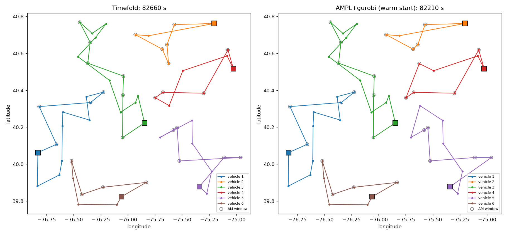

# Timefold 車両ルーティング（複数デポ VRPTW）の AMPL 版

[Timefold quickstarts の vehicle-routing](https://github.com/TimefoldAI/timefold-quickstarts/tree/stable/use-cases/vehicle-routing)
と同じ問題を AMPL（amplpy）で混合整数計画として解き、`../vrp/フィラデルフィア.json` に保存されている Timefold の解と比較します。

| ファイル | 内容 |
|---|---|
| `mdvrptw.mod` | AMPL モデル（2添字アーク定式化＋車両割当変数） |
| `solve_mdvrptw.py` | データ読込・SEC 切除平面・求解・比較実験（amplpy） |
| `results/` | 実験結果（`comparison.csv`、`routes.json`、`routes_comparison.png`、Timefold 形式の `フィラデルフィア_ampl.json`、`run.log`） |

## 問題（Timefold と同じ定義）

- 訪問先 55 件、車両 6 台。車両ごとにデポ（`homeLocation`）、容量、出発時刻 7:30 が異なる
- 時間枠：午前 8:00–12:00 または午後 13:00–18:00。早く着いたら待つ。サービス終了が `maxEndTime` 以前（ハード制約）
- 容量制約（ハード制約）、全訪問先を割り当てる
- 目的：デポへの帰着を含む総走行時間（秒）の最小化（Timefold のソフトスコア）
- 走行時間は Timefold の `HaversineDrivingTimeCalculator` と同じ式：
  Haversine 距離をメートルに丸めて、時速 50 km で秒に丸める。JSON 内の 55 区間の走行時間と完全に一致することを確認済み

## 定式化の要点

- 変数：`x[i,j]`（訪問先間のアーク）、`y[k,j]`（車両 k のデポ→j）、`z[i,k]`（i→車両 k のデポ）、`a[i,k]`（i を車両 k が担当）、`T[i]`（サービス開始時刻）
- `x[i,j] + a[i,k] - a[j,k] <= 1` で車両の識別をルートに沿って伝え、自デポへの帰着と車両別容量を保証
- 時間伝播はアークごとのタイトな big-M（`due[i] + t[i,j] - ready[j]`）。部分巡回も同時に排除
- 時間枠で不可能なアーク（午後→午前など）は前処理で削除（訪問先間 2,970 本 → 2,210 本）
- 部分巡回除去制約（SEC）を LP 緩和上で最小カットにより分離し、MIP の前に追加（LP 下界 66,625 → 74,453）

インジケータ制約（`x[i,j] = 1 ==> T[j] >= ...`）でも書けますが、AMPL MP の変換で変数が 3,255 → 10,020 に増えるうえ、Gurobi 300 秒の予備実験では暫定解は同じ 82,210、下界も 76,476 対 76,210 とほぼ差がなかったため、線形形にしています。

## 実行方法

pip の `ampl_module_base` はデモライセンス（500 変数上限）なので、正規ライセンスのある AMPL を `AMPL_PATH` で指定します（既定値は `~/Documents/ampl/ampl.macos64`）。

```bash
python timefold/vrp2/solve_mdvrptw.py --timelimit 600 --solvers highs,gurobi
```

## 実験結果（各ソルバー 600 秒、threads=8）

| 手法 | 総走行時間 [s] | 下界 [s] | gap | Timefold 比 |
|---|---:|---:|---:|---:|
| Timefold（JSON の解） | 82,660 | – | – | – |
| LP 緩和 | – | 66,625 | – | – |
| LP 緩和 + SEC 32 本 | – | 74,453 | – | – |
| AMPL + HiGHS | 実行可能解なし | 75,399 | – | – |
| AMPL + Gurobi | 82,257 | 77,004 | 6.4% | −0.49% |
| AMPL + Gurobi（Timefold 解でウォームスタート） | **82,210** | **77,652** | 5.5% | **−0.54%** |

- まず Timefold のルートを AMPL モデルに固定して解き、目的値が 82,660 と一致することを確認（モデルの妥当性チェック）
- Gurobi はコールドスタートでも Timefold より良い解を見つけた。ウォームスタートでは 82,210 秒（−450 秒）
- 改善の中身は 2 件の入れ替えだけ：訪問先 32 を車両 2 → 車両 4、訪問先 55 を車両 4 → 車両 5 へ移し、車両 5 の最初の 2 件の順序を入れ替え。ほかの 4 台のルートは Timefold と同一
- 得られた下界 77,652 から、Timefold の解は最適値から多くても 6.1% 以内とわかる。最適性はまだ証明できていない（時間枠の big-M による LP の弱さが主因。3 添字定式化も試したが SEC 後の LP 下界は 74,517 でほぼ同じ）
- HiGHS は 600 秒で実行可能解を見つけられなかった。AMPL の HiGHS ドライバは MIP スタートに対応していないため、ウォームスタートは Gurobi のみ


